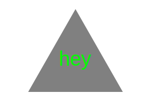

# SVG Logo Maker

## Description
The SVG Logo Maker is a Node.js command-line application that empowers users to generate simple SVG logos by selecting a shape, color, and entering text. This tool is designed from scratch, requiring no starter code, and aims to facilitate quick creation of logos for projects or personal use.

* **Motivation:** Developed to assist developers and content creators in generating logos without the need for complex design software.
* **Purpose:** To offer a streamlined, efficient method for creating visually appealing logos directly from the command line.
* **Problem It Solves:** Eliminates the time and effort typically required to design a basic logo, providing a simple yet flexible solution.
* **What I Learned:** This project enhanced my proficiency in Node.js, particularly in handling user input and dynamically generating SVG files. It also highlighted the importance of modular design and testing in software development. 

## Table of Contents
* [Installation](#installation)
* [Usage](#usage)
* [Video Demonstration and Screenshot](#video-demonstration-and-screenshot)
* [Generated Example SVG Logos](#generated-example-svg-logos)
* [Tests](#tests)
* [License](#license)
* [Questions](#questions)

## Installation 
To get started with SVG Logo Maker:

1. Ensure Node.js is installed on your machine. You can download it from [nodejs.org](https://nodejs.org/).
2. Clone the repository to your local machine: `git clone https://github.com/ktotah/ktotah-logo-maker.git`.
3. Navigate to the project directory in your terminal.
4. Install the necessary dependencies by running: `npm install inquirer@8.2.4` and `npm install --save-dev jest` in your terminal.
5. You are now ready to run the application or its tests. 

## Usage 
Launch the application by typing `node index.js` in your terminal within the project directory. Follow the prompts to choose your logo's text, text color, shape, and shape color. Upon completion, the logo will be saved as`logo.svg` in your project directory.

## Video Demonstration and Screenshot
A video demonstration of the SVG Logo Maker in action can be viewed [here](https://drive.google.com/file/d/17rb4AR3xwhQRcuBiydUAwoSd0Q_8yGdr/view?usp=sharing).

Additionally, here is a screenshot demonstrating that command-line functionality of the SVG Logo Maker:

## Generated Example SVG Logos
Here are some example SVG logos that were generated using this application: 
 
 

## Tests
The SVG Logo Maker includes a suite of Jest tests to ensure each component functions correctly. To run these tests, execute `npm test` in the project directory. These tests verify the application's ability to render SVGs accurately based on user input.
  
## License

This project is licensed under the [MIT License](./LICENSE).
  
## Questions
For any questions, please contact me with the information below.

* GitHub: [ktotah](https://github.com/ktotah)

* Email: [ket2137@columbia.edu](mailto:ket2137@columbia.edu)